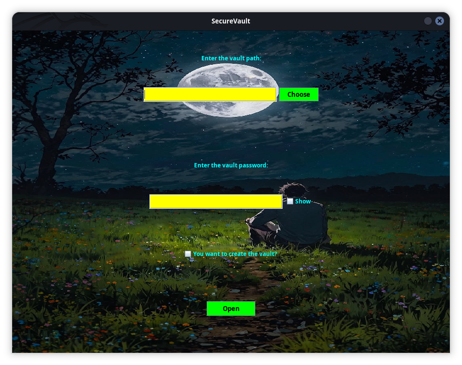
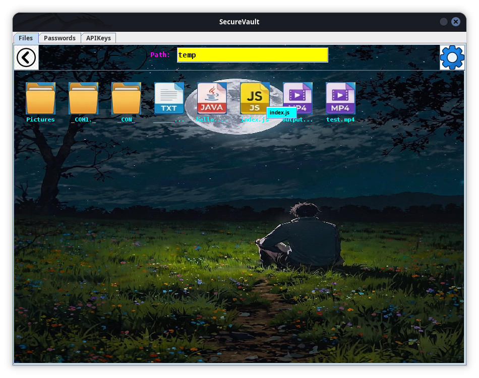
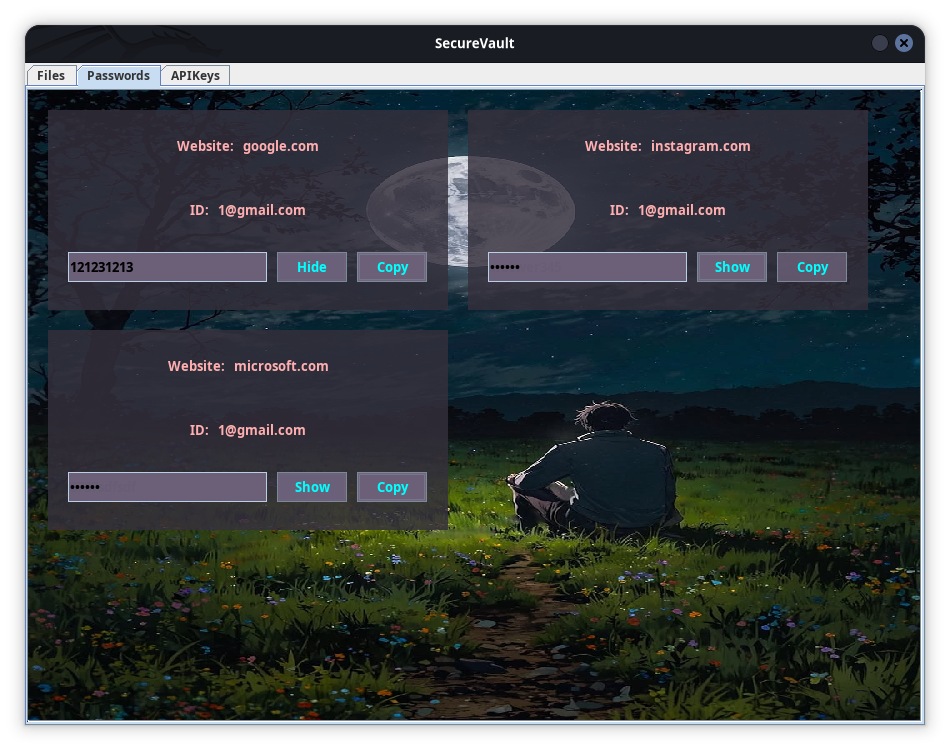

# 🖥️ SecureVault GUI 2.0.0

SecureVault GUI is a desktop application built with Java Swing that provides a user-friendly graphical interface for managing encrypted vaults. It offers all the security capabilities of SecureVault while making vault management accessible through an intuitive desktop experience.

The GUI application acts as a frontend for the SecureVault Console Engine, launching and communicating with the core application to perform vault operations securely and consistently.

---

## ✨ Features

### 📦 Secure Storage

Store and manage:

* 📄 Files
* 📁 Directories
* 🔑 Passwords
* 🛠️ API Keys

All data is encrypted before being written to disk.

---

### 🖥️ User-Friendly Interface

The graphical interface allows users to:

* Create vaults
* Open existing vaults
* Store files and directories
* Manage passwords
* Manage API keys
* Configure security settings
* Change master passwords
* Enable or disable protection mechanisms

without interacting directly with the command line.

---

### 🔒 Strong Security

SecureVault GUI utilizes the SecureVault encryption engine which provides:

* AES/GCM/NoPadding encryption
* PBKDF2WithHmacSHA256 key derivation
* AES-256 keys
* Authenticated encryption

All cryptographic operations are performed by the SecureVault backend.

---

### 🗝️ Vault-Key Architecture

Each vault is protected using a dedicated random vault key.

```text id="h1rq2m"
Master Password
       │
       ▼
PBKDF2WithHmacSHA256
       │
       ▼
Key Encryption Key
       │
       ▼
Encrypted Vault Key
       │
       ▼
Random Vault Key
       │
       ▼
Vault Contents
```

This architecture enables efficient password changes while maintaining strong security.

---

### 🔄 Password Rotation

Users can change their master password at any time.

Since only the encrypted vault key needs to be updated, password changes remain fast regardless of vault size.

---

### ⚡ Parallel File Processing

SecureVault supports parallel processing of multiple files to improve performance when handling large datasets.

Benefits include:

* Faster imports
* Faster exports
* Improved responsiveness
* Better utilization of modern hardware

---

### 🚨 Lockdown Mode

Lockdown Mode can be enabled:

* Manually
* Automatically after a configurable number of failed login attempts

While active, vault contents remain inaccessible.

---

### 💥 Self-Destruct Mode

For highly sensitive vaults, SecureVault can permanently destroy vault contents.

Supported options:

* Manual self-destruction
* Automatic destruction after a configurable number of failed authentication attempts

---

### 🌍 Cross-Platform Compatibility

SecureVault vaults are platform-independent.

Tested on:

* 🐧 Linux
* 🪟 Windows

Vaults created on one platform can be accessed on another without modification.

---

## 🏗️ Architecture

SecureVault GUI follows a frontend-backend architecture.

```text id="5mxsfr"
+----------------------+
|   SecureVault GUI    |
|      (Swing)         |
+----------+-----------+
           |
           | Process Communication
           |
           ▼
+----------------------+
| SecureVault Console  |
|      Engine          |
+----------------------+
```

The GUI application launches the SecureVault Console Engine as a separate Java process and communicates with it to perform vault operations.

### Advantages

* Single security implementation
* Consistent behavior across interfaces
* Simplified maintenance
* Clear separation between UI and core functionality

---

## 🛡️ Security Overview

| Component             | Implementation         |
| --------------------- | ---------------------- |
| Encryption Algorithm  | AES/GCM/NoPadding      |
| Key Size              | AES-256                |
| Key Derivation        | PBKDF2WithHmacSHA256   |
| Authentication        | GCM Authentication Tag |
| Password Rotation     | ✅ Supported            |
| Lockdown Mode         | ✅ Supported            |
| Self-Destruct Mode    | ✅ Supported            |
| Cross-Platform Vaults | ✅ Supported            |

---

## 🏗️ Technology Stack

| Category         | Technology                  |
| ---------------- | --------------------------- |
| Language         | Java 25                     |
| GUI Framework    | Swing                       |
| Build Tool       | Maven                       |
| Encryption       | AES-GCM                     |
| Key Derivation   | PBKDF2-HMAC-SHA256          |
| Concurrency      | Virtual Threads & Executors |
| Platform Support | Linux, Windows              |

---

## 📸 Screenshots

Add screenshots of the application here.

### Main Window

<p align="center">
    
</p>

### Vault Management

<p align="center">
    
</p>

### Password Manager

<p align="center">
    
</p>

---

## 📋 Requirements

* Java 25
* Maven
* SecureVault (secure-vault-core)

---

## 🏗️ Building

* Clone the repository:

```bash id="s62tua"
git clone https://github.com/anonymous6291/secure-vault-gui.git
cd secure-vault-gui
```

* Make the jar file:

```text
mvn clean package
```

* Download SecureVault:

> Linux
> ```bash
> wget https://github.com/anonymous6291/secure-vault-core/raw/main/release/linux/SecureVault_V1.0.0 -O SecureVault
> ```

> Windows
> ```cmd
> wget https://github.com/anonymous6291/secure-vault-core/raw/main/release/windows/SecureVault_V1.0.0.exe -O SecureVault.exe
> ```

* Run
```text
java -jar ./target/secure-vault-gui-1.0-SNAPSHOT.jar
```


---

## 🎯 Use Cases

SecureVault GUI is ideal for users who want:

* Secure local file storage
* Password management
* API key management
* Cross-platform encrypted vaults
* Security-focused desktop applications
* A graphical alternative to command-line vault management

---

## 🚀 Project Highlights

* 🖥️ Desktop application built with Swing
* 🔐 AES-GCM authenticated encryption
* 🗝️ Dedicated vault-key architecture
* 🔄 Efficient password rotation
* ⚡ Parallel file processing
* 🚨 Configurable Lockdown Mode
* 💥 Configurable Self-Destruct Mode
* 🌍 Cross-platform vault compatibility
* 📁 File and directory storage
* 🔑 Password and API key management
* ☕ Built with Java 25
* 🔗 Frontend-backend architecture using process communication

---

## ⚠️ Disclaimer

SecureVault GUI is an educational and portfolio project developed to explore desktop application development, cryptography, concurrency, process management, and secure storage systems in Java.

Users should independently evaluate whether the software meets their security requirements before using it to protect highly sensitive information.
